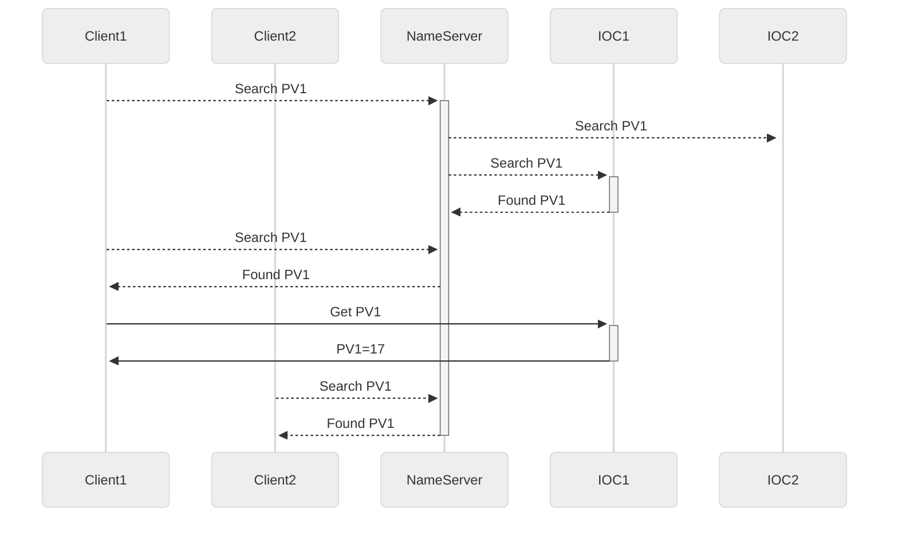

# PVmapper resolves PV names to IOC servers

PVmapper project started after arising challenges to control the broadcast
floods in a saturated EPICS environment. With emerging number of busy EPICS
operator screens, misbehaving Channel Access clients, and the tendency to
develop run-once tools for reporting or AI needs, the EPICS broadcast traffic
seems to be very intense and on occasions detremental to the health of the
controls network infrastructure.

Many facilities utilizing EPICS have come to similar conclusions in the past.
Various ideas have emerged how to address the issue, including the original
[CA-nameserver](https://epics.anl.gov/extensions/nameserver/index.php).
Lately a more modern Java implementation has been
[cfNameserver](https://github.com/ChannelFinder/cfNameserver) implemented
and is part of the ChannelFinder and recsync feature rich framework.

The goal of this project is to be a simple yet reliable EPICS name server
that works seamlessly in any existing EPICS environment. It aims to build
on original EPICS ideology of self discovering environment, but consolidating
broadcast traffic for reduced resources footprint. Aside from simplicity, the
motivation for this project were:
* reduce EPICS broadcast footprint
* support any IOC (including LabView, pcaspy etc.) without modifying it
* recognize new IOCs dynamically

## Functional Overview


## Building and Running

PVmapper requires C++17 capable compiler, no other dependencies are needed.
Compile code with:

```
make
```

PVmapper can then be started using the provided sample configuration:

```
./build/pvmapper examples/sample.cfg
```

## PVmapper Configuration
PVmapper is configured using a plain-text configuration file. The file defines
access control rules, network settings, search behavior, cache management, 
and logging options for the CA nameserver.

Lines beginning with # are comments and are ignored. Each configuration option 
is specified as a KEY=VALUE pair.

### Listen Address

The CA_LISTEN_ADDRESS parameter defines the local IP address and UDP port on
which PVmapper listens for incoming EPICS Channel Access (CA) client requests.

PVmapper currently supports Channel Access (CA) only and processes CA traffic over UDP.
It listens only on the explicitly configured IP address and port; 
no other interfaces or ports are used unless specified.

Example
```
CA_LISTEN_ADDRESS=0.0.0.0:5053
```

In this example, PVmapper listens on UDP port 5053 on all local interfaces.
This is the default configuration and is suitable for most deployments.

To explicitly bind PVmapper to multiple interfaces or addresses, specify additional entries:
```
CA_LISTEN_ADDRESS=192.168.1.10:5053
CA_LISTEN_ADDRESS=10.0.0.10:5053
```

### Search Address

The CA_SEARCH_ADDRESS parameter defines the network address and UDP port that 
PVmapper uses to send Channel Access (CA) search requests when attempting 
to locate Process Variables (PVs).

PVmapper currently supports EPICS Channel Access (CA) only. It sends and 
receives CA search traffic using UDP and listens only on the explicitly 
configured IP address and port.

Example
```
CA_SEARCH_ADDRESS=192.168.1.255:5064
```

In this example, PVmapper sends CA search requests to the broadcast address
192.168.1.255 on UDP port 5064, which is the standard Channel Access search port.

To search across multiple subnets or interfaces, specify additional CA_SEARCH_ADDRESS entries:
```
CA_SEARCH_ADDRESS=192.168.1.255:5064
CA_SEARCH_ADDRESS=10.0.0.255:5064
```

### Search Intervals

The SEARCH_INTERVALS parameter controls how often PVmapper sends PV search 
requests while attempting to locate a Process Variable (PV).

Search Lifecycle:
* A PV search starts when the first client issues a search request for that PV.
* PVmapper continues sending CA search requests according to the configured search intervals.
* Searches continue until the PV is found, or while any client is still requesting the PV.
* If no client requests for a PV are received when the purge mechanism runs, the PV is removed from the active search list and all searches for that PV stop.

This behavior helps limit unnecessary network traffic and keeps the internal search state efficient.

While a PV is being searched for, PVmapper sends CA search requests using the sequence of delays specified by SEARCH_INTERVALS.
```
SEARCH_INTERVALS=1,5,10,30,60,300
```

Each value represents a delay (in seconds) before the next search attempt.
Intervals are applied in order. Once the end of the list is reached, the 
last interval is reused repeatedly until the PV is found or searching stops.
The example above will send:
* 2nd search after 1 second
* 3rd search after 5 seconds
* 4th search after 10 seconds
* Subsequent searches every 300 seconds

EPICS Channel Access clients typically use an exponential backoff strategy, 
increasing the delay between search retries until a maximum interval is reached.
The default PVmapper configuration follows a similar pattern,
but allows the behavior to be explicitly configured.
This makes it possible to tune search frequency to balance network traffic
and IOC detection considerations. As a result:

* PVmapper can only discover newly started IOCs by sending search requests.
* Longer search intervals increase the time required for PVmapper to detect a new IOC.
* Shorter intervals improve detection latency but increase network traffic.
* Care should be taken when adjusting search intervals, especially in large or shared networks.

### Access Control Rules

PVmapper supports access control rules that determine which Process Variables (PVs) 
may be searched for, and which clients are allowed to perform searches. 
This is particularly useful in environments with gateways or multiple nameservers.

Each rule must begin with one of the following keywords:
* ALLOW_PV
* DENY_PV
* ALLOW_CLIENT
* DENY_CLIENT

The value must be either:
* a full PV name,
* a full client IP address, or
* a POSIX regular expression.

Rules are evaluated in order, top to bottom. The first matching rule within 
the PV or CLIENT group is applied. If no matching rule is found, PV searches 
are allowed by default.

Example
```
ALLOW_PV=TEST.*     # Allow all PVs starting with "TEST"
DENY_PV=T.*         # Deny all other PVs starting with "T"
# ALLOW_PV=.*       # Uncomment to explicitly allow all PVs, this is default

DENY_CLIENT=192.168.1.176     # Block a particular IP
DENY_CLIENT=192.168.86.*      # Block all IPs from .86 network
```

In this example, TEST:PV1 is allowed, while TEMP:PV1 is denied.

### Logging

LOG_LEVEL controls the verbosity of PVmapper logging. Valid options:

* ERROR
* INFO
* VERBOSE
* DEBUG

By default, log messages are sent to the program console. SYSLOG_FACILITY
allows to send logs to the syslog using the specified facility:
* LOCAL0–LOCAL7
* USER
* SYSLOG
* DAEMON

SYSLOG_ID dfines the identifier used in syslog entries.
This should be a unique name to make filtering log messages easier.

SYSLOG_ID=PVmapper
